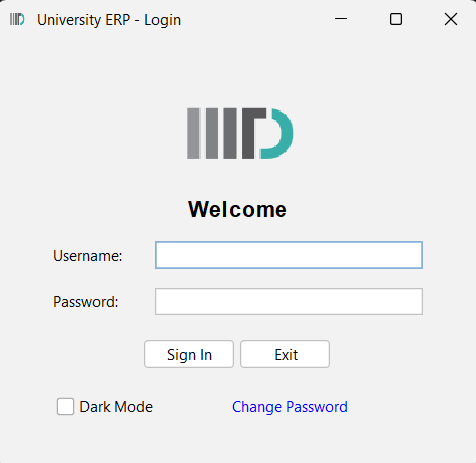
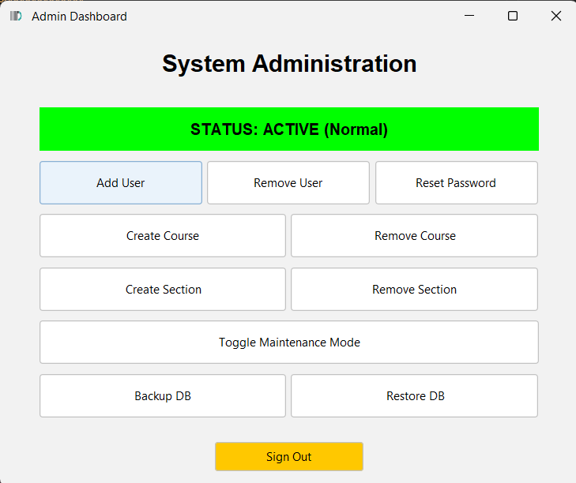
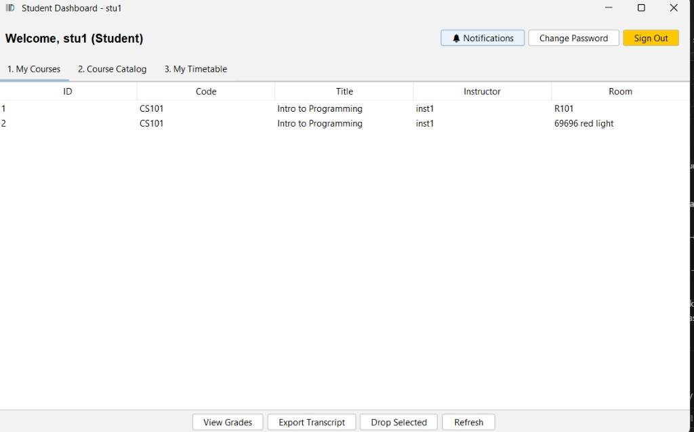
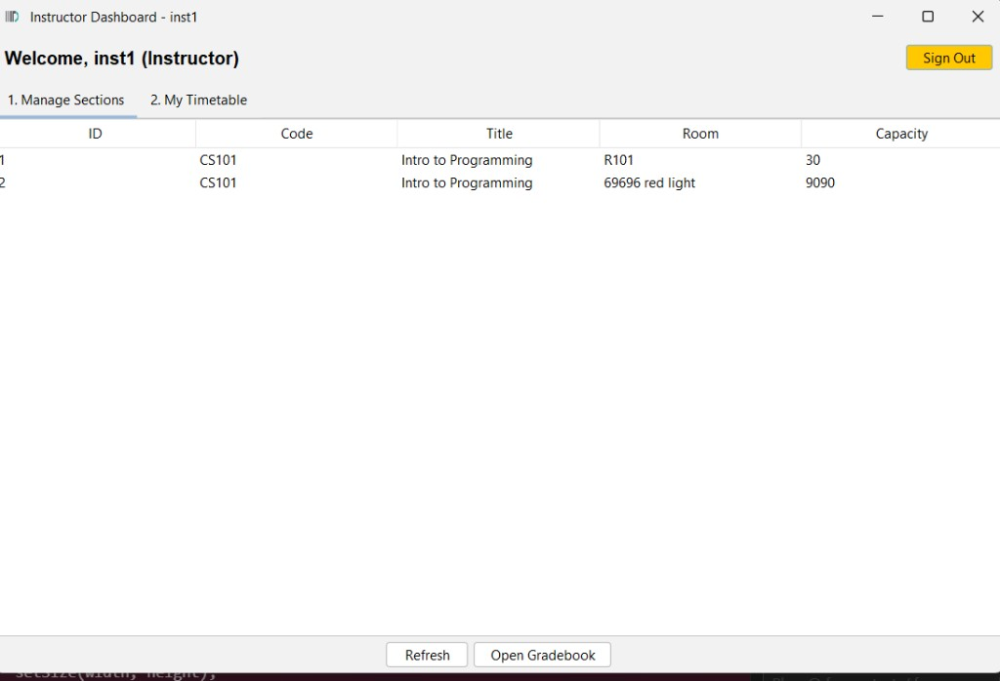
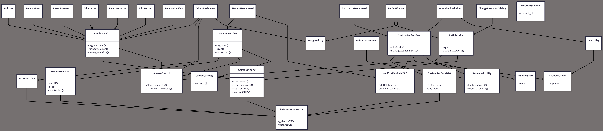

# 🎓 University ERP System

[](https://openjdk.org/)
[](https://docs.oracle.com/javase/tutorial/uiswing/)
[](https://dev.mysql.com/)
[](https://opensource.org/licenses/MIT)

A **production-quality Java desktop application** for university resource planning. Implements role-based access control, secure authentication, course management, enrollment, grading, and administrative operations using a **layered architecture** with clear separation of concerns.

---

## 💡 Why This Project Stands Out

- **Clean Architecture** — UI, Service, Data, and Domain layers with no business logic in the presentation layer
- **Security-First** — BCrypt password hashing, dual-database design (auth vs. academic data), failed-login tracking
- **Production Patterns** — JDBC for data access, configurable properties, backup/restore, CSV import/export
- **Maintainable Codebase** — Modular packages, documented design decisions, and comprehensive documentation

---

## ✨ Features

| Feature | Description |
|--------|-------------|
| **Role-based access** | Admin, Instructor, and Student roles with dedicated dashboards and permission enforcement |
| **Admin management** | User CRUD, course/section management, maintenance mode, backup/restore, password reset |
| **Student management** | Course catalog, enrollment/drop, timetable, grade view |
| **Instructor management** | Assigned sections, gradebook with CSV import/export |
| **Course catalog** | Browse sections with capacity, schedule, room, and instructor |
| **Enrollment system** | Capacity checks, duplicate-enrollment prevention |
| **Authentication** | BCrypt hashing, change password, admin reset, failed-attempt tracking |
| **Notifications** | In-app notifications for enrollment and system events |

---

## 🛠 Tech Stack

| Layer | Technology |
|-------|------------|
| **Language** | Java |
| **UI** | Java Swing (FlatLaf) |
| **Database** | JDBC, MySQL |
| **Security** | jBCrypt |
| **Architecture** | Layered (UI → Service → Data → Domain) |

---

## 📸 Application Screenshots

<div align="center">

| Login | Admin Dashboard |
|:-----:|:--------------:|
|  |  |

| Student Dashboard | Instructor Dashboard |
|:-----------------:|:--------------------:|
|  |  |

</div>

---

## 📁 Project Structure

```
.
├── README.md
├── LICENSE
├── config/
│   ├── config.properties.example
│   └── config.properties          # DB credentials (gitignored)
├── docs/
│   ├── architecture.md            # Layer-by-layer architecture
│   ├── system-design.md           # Auth, RBAC, enrollment, grading
│   ├── uml-diagram.png
│   └── screenshots/
├── src/main/java/edu/univ/erp/
│   ├── Main.java
│   ├── auth/          # Authentication, BCrypt
│   ├── access/        # Maintenance mode, access control
│   ├── data/          # JDBC data access
│   ├── domain/        # Entities (CourseCatalog, StudentGrade, etc.)
│   ├── service/       # Business logic
│   ├── ui/            # Swing (admin, instructor, student)
│   └── util/          # CSV, backup, images
├── resources/images/
├── scripts/           # run.bat, run.sh, db setup
└── lib/               # FlatLaf, jBCrypt, MySQL Connector
```

---

## 🏗 Architecture

The system follows a **strict layered architecture**:



| Layer | Responsibility |
|-------|----------------|
| **UI** | Swing interfaces, user input, display |
| **Service** | Business logic, validation, orchestration |
| **Auth / Access** | Login, password hashing, maintenance mode |
| **Data** | JDBC queries, database operations |
| **Domain** | Entities and DTOs |

📖 **Full documentation:** [architecture.md](docs/architecture.md) · [system-design.md](docs/system-design.md)

---

## 🚀 How to Run

### Prerequisites

- **JDK 11+**
- **MySQL Server** with `auth_db` and `erp_db` created
- JARs in `lib/` (FlatLaf, jBCrypt, MySQL Connector)

### Quick Start

```bash
# 1. Clone
git clone <repo-url>
cd UnivERP-main

# 2. Database setup
# Run scripts/db/auth_db_setup.sql and scripts/db/erp_db_setup.sql in MySQL

# 3. Config
cp config/config.properties.example config/config.properties
# Edit config.properties with your MySQL credentials

# 4. Run (Windows)
scripts\run.bat

# Run (Linux/macOS)
chmod +x scripts/run.sh && ./scripts/run.sh
```

### Run in IntelliJ IDEA

1. **File → Open** → select project root
2. Right-click **`lib`** → **Add as Library**
3. Right-click **`Main.java`** → **Run 'Main.main()'**
4. If config not found: **Run → Edit Configurations** → set **Working directory** to project root

### Default Credentials (after DB seed)

| Role | Username | Password |
|------|----------|----------|
| Admin | admin1 | pass123 |
| Instructor | inst1 | pass123 |
| Student | stu1 | pass123 |

---

## 📚 Documentation

- [**Architecture**](docs/architecture.md) — Layer breakdown, data flow, configuration
- [**System Design**](docs/system-design.md) — Authentication, RBAC, course management, enrollment, notifications

---

## 🔮 Future Enhancements

- Web version with REST API
- Spring Boot migration
- React/Vue frontend
- Docker containerization

---

## 🤝 Contributing

1. Fork the repository
2. Create a feature branch (`git checkout -b feature/your-feature`)
3. Commit changes (`git commit -m 'Add feature'`)
4. Push (`git push origin feature/your-feature`)
5. Open a Pull Request

---

## 📄 License

MIT License — see [LICENSE](LICENSE).

---

<p align="center"><strong>University ERP System</strong> — A portfolio-ready Java application demonstrating layered architecture, security best practices, and clean code.</p>
